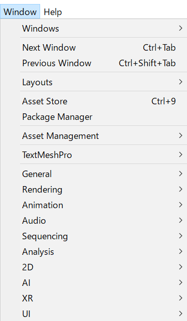
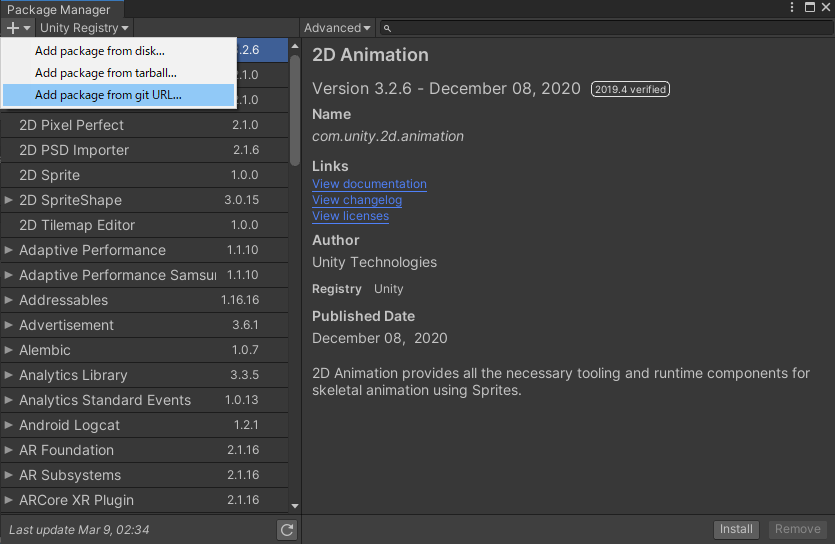
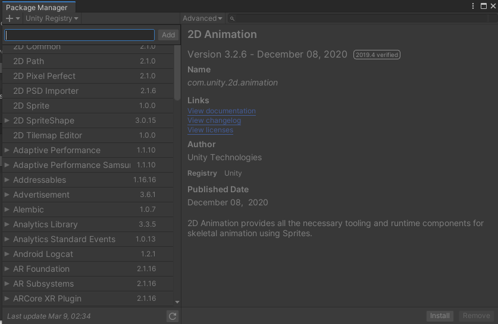

[](https://github.com/TakuKobayashi/UnityCipher/actions/workflows/unity-test.yml)

# UnityCipher

This is Cipher Libraries in Unity, include the AESCipher and RSACipher.

# What is UnityCipher?

UnityCipher can be implemented AES encryption(Exactly, Rijndael cipher, not AES cryptography) and RSA encryption simply and high secure, in Unity(C#).

# Install

* If you want to download a unitypackage, you can download from [Releases](https://github.com/TakuKobayashi/UnityCipher/releases).

* If you want use the UPM, you add below to `Packages/manifest.json`.

```Packages/manifest.json
{
  "dependencies": {
    "net.taptappun.taku.kobayashi.unitycipher": "https://github.com/TakuKobayashi/UnityCipher.git?path=/Assets/UnityCipher",
    ...
  }
}
```

or input the url `https://github.com/TakuKobayashi/UnityCipher.git?path=/Assets/UnityCipher` to `Add package from git URL` (`Window` -> `PackageManager` like this.)








# Usage

For detail, look to ```UnityCipher/Examples/```
And also, add ```using UnityCipher```, you can use UnityCipher.

## Use AES encryption

### Encryption

You can encrypt it by calling the following method.

```C#
string encrypted = RijndaelEncryption.Encrypt(plainText, passwordText);
```

```plainText``` can also use ```byte[]``` as well as string.
If you use ```byte[]```, give the encritpted ```byte[]```, like this.

```C#
byte[] encrypted = RijndaelEncryption.Encrypt(plainBinary, passwordText);
```

### Decryption

You can decrypt it by calling the following method.

```C#
string plainText = RijndaelEncryption.Decrypt(encryptedText, passwordText);
```

If you can successfully decrypt the encrypted one, you can get the decrypted one.
```plainText``` can also use ```byte[]``` as well as string.
If you use ```byte[]```, give the decrypted ```byte[]```, like this.

```C#
byte[] plainBinary = RijndaelEncryption.Decrypt(encryptedBinary, passwordText);
```
