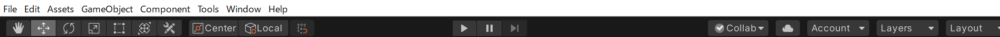
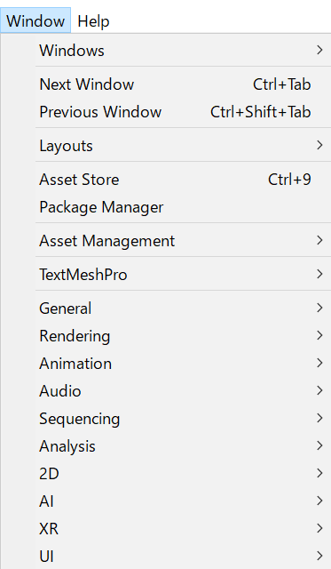
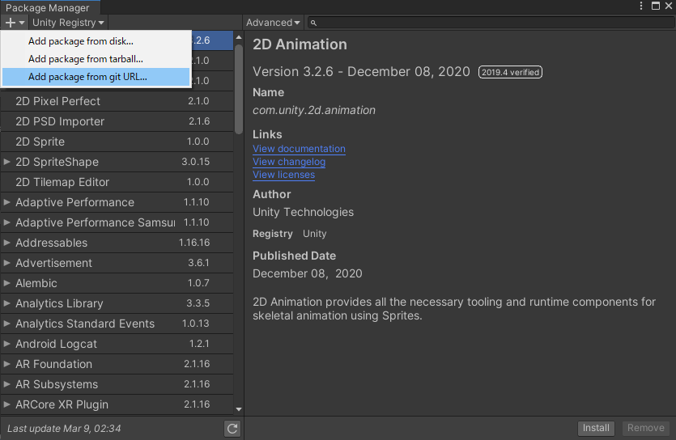
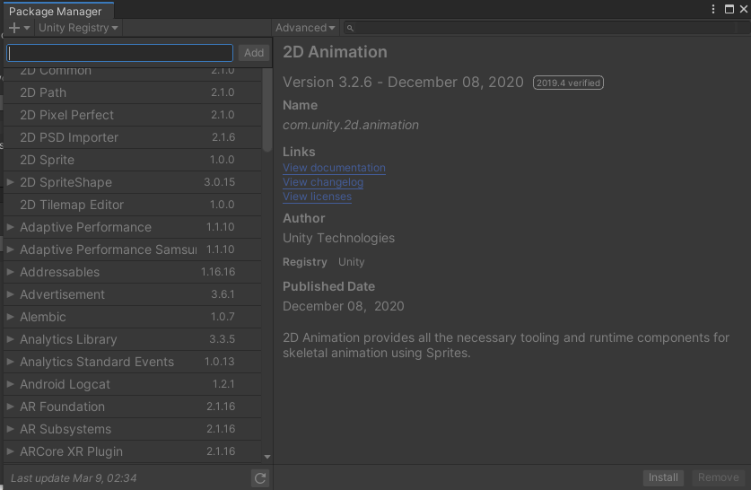

[](https://github.com/TakuKobayashi/UnityCipher/actions/workflows/unity-test.yml)

# UnityCipher

This is Cipher Libraries in Unity, include the AESCipher and RSACipher.

# What is UnityCipher?

UnityCipher can be implemented AES encryption(Exactly, Rijndael cipher, not AES cryptography) and RSA encryption simply and high secure, in Unity(C#).

# Install

* If you want to download a unitypackage, you can download from [Releases](https://github.com/TakuKobayashi/UnityCipher/releases).

* To install version 2.0.0 with UPM, add the dependency below to
  `Packages/manifest.json`. Pinning the Git tag prevents an unintended update
  when the `master` branch changes.

```Packages/manifest.json
{
  "dependencies": {
    "net.taptappun.taku.kobayashi.unitycipher": "https://github.com/TakuKobayashi/UnityCipher.git?path=/Assets/UnityCipher#v2.0.0",
    ...
  }
}
```

Alternatively, select **Add package from git URL** in Package Manager and enter:

```text
https://github.com/TakuKobayashi/UnityCipher.git?path=/Assets/UnityCipher#v2.0.0
```

The following URL installs the latest development version from `master` and
is not recommended for production projects:

```text
https://github.com/TakuKobayashi/UnityCipher.git?path=/Assets/UnityCipher
```









# Continuous integration

GitHub Actions runs the EditMode test suite with the Unity and Node.js versions,
project path, and test mode configured in the workflow matrix. Tests run for
pushes to `master`, or when manually dispatched.

The workflow activates Unity Personal directly on the GitHub-hosted runner.
Configure these repository Actions secrets:

- `UNITY_EMAIL`: the Unity account email address
- `UNITY_PASSWORD`: the Unity account password

The workflow uses the maintained, third-party
[`buildalon/activate-unity-license`](https://github.com/buildalon/activate-unity-license)
action to activate and return the Personal license through Unity's Licensing
Client. It does not require a manually generated `.ulf`, `UNITY_LICENSE`, or
`UNITY_AUTHENTICATOR_KEY` secret.

Test result XML files and logs are uploaded as workflow artifacts even when a
test fails.

# Usage

For detail, look to ```UnityCipher/Examples/```
And also, add ```using UnityCipher```, you can use UnityCipher.

If your scripts use an Assembly Definition (`.asmdef`), add `UnityCipher` to
its **Assembly Definition References** first. A `using UnityCipher;` directive
alone does not create a reference between assemblies.

## Use AES encryption

### Encryption

You can encrypt it by calling the following method.

```C#
string encrypted = RijndaelEncryption.Encrypt(plainText, passwordText);
```

```plainText``` can also use ```byte[]``` as well as string.
If you use ```byte[]```, give the encritpted ```byte[]```, like this.

```C#
byte[] encrypted = RijndaelEncryption.Encrypt(plainBinary, passwordText);
```

### Decryption

You can decrypt it by calling the following method.

```C#
string plainText = RijndaelEncryption.Decrypt(encryptedText, passwordText);
```

If you can successfully decrypt the encrypted one, you can get the decrypted one.
```plainText``` can also use ```byte[]``` as well as string.
If you use ```byte[]```, give the decrypted ```byte[]```, like this.

```C#
byte[] plainBinary = RijndaelEncryption.Decrypt(encryptedBinary, passwordText);
```
